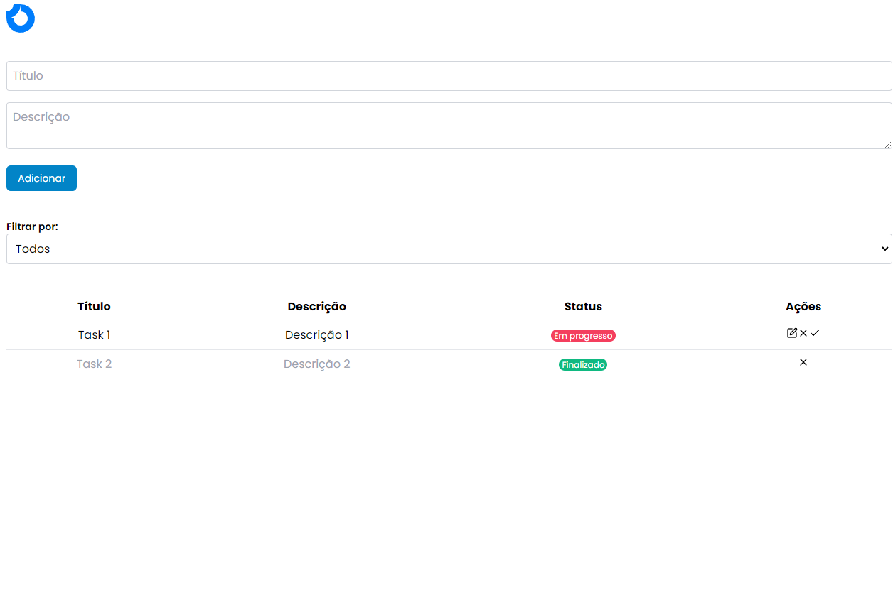
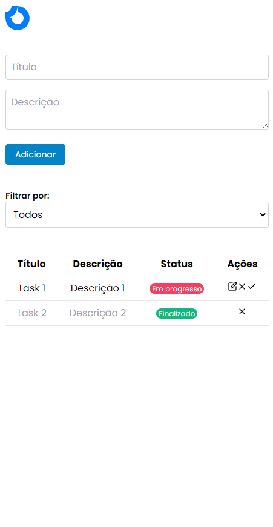

# Todo List Challenge

### Versão Web

### Versão Responsivo


Este é um projeto de lista de tarefas desenvolvido com React, TypeScript e várias outras tecnologias modernas. O objetivo deste projeto é fornecer uma aplicação de lista de tarefas funcional e bem estruturada.

## Tecnologias Utilizadas

- **React**: Biblioteca JavaScript para construção de interfaces de usuário.
- **TypeScript**: Superset do JavaScript que adiciona tipagem estática.
- **Vite**: Ferramenta de build rápida para projetos web modernos.
- **ESLint**: Ferramenta de linting para manter a qualidade do código.
- **Tailwind CSS**: Framework CSS utilitário para estilização rápida.
- **Axios**: Cliente HTTP baseado em Promises para fazer requisições.
- **json-server**: Servidor REST API para prototipação rápida.
- **uuid**: Biblioteca para geração de UUIDs.
- **Vitest**: Framework de testes para projetos Vite.
- **Testing Library**: Conjunto de utilitários para testar componentes React.

## Estrutura do Projeto

```
.github/
	pull_request_template.md
	workflows/
		ci.yaml
.gitignore
.jest/
coverage/
	lcov-report/
db.json
eslint.config.js
index.html
package.json
postcss.config.js
public/
	assets/
README.md
src/
	api/
		axios.ts
	App.tsx
	assets/
	components/
		Badge.spec.tsx
		Badge.tsx
		Header.spec.tsx
		Header.tsx
		tasks/
	contexts/
		TaskContext.tsx
	index.css
	main.tsx
	services/
	types/
	vite-env.d.ts
tailwind.config.js
test/
	setup.ts
tsconfig.app.json
tsconfig.json
tsconfig.node.json
vite.config.ts
```

## Instalação

1. Clone o repositório:

```sh
git clone https://github.com/geraldobl58/todo-list-challenge.git
cd todo-list-challenge
```

2. Instale as dependências:

```sh
npm install
```

## Scripts Disponíveis

- [`dev`](command:_github.copilot.openSymbolFromReferences?%5B%22%22%2C%5B%7B%22uri%22%3A%7B%22scheme%22%3A%22file%22%2C%22authority%22%3A%22%22%2C%22path%22%3A%22%2Fhome%2Fgeraldoluiz%2FDevelopment%2Fweb%2Ftodo-list-challenge%2Fpackage.json%22%2C%22query%22%3A%22%22%2C%22fragment%22%3A%22%22%7D%2C%22pos%22%3A%7B%22line%22%3A6%2C%22character%22%3A5%7D%7D%5D%2C%22f8456656-4e43-43f7-9bd6-13812a4e9108%22%5D "Go to definition"): Inicia o servidor de desenvolvimento.
- [`build`](command:_github.copilot.openSymbolFromReferences?%5B%22%22%2C%5B%7B%22uri%22%3A%7B%22scheme%22%3A%22file%22%2C%22authority%22%3A%22%22%2C%22path%22%3A%22%2Fhome%2Fgeraldoluiz%2FDevelopment%2Fweb%2Ftodo-list-challenge%2Fpackage.json%22%2C%22query%22%3A%22%22%2C%22fragment%22%3A%22%22%7D%2C%22pos%22%3A%7B%22line%22%3A7%2C%22character%22%3A5%7D%7D%5D%2C%22f8456656-4e43-43f7-9bd6-13812a4e9108%22%5D "Go to definition"): Compila o projeto para produção.
- [`lint`](command:_github.copilot.openSymbolFromReferences?%5B%22%22%2C%5B%7B%22uri%22%3A%7B%22scheme%22%3A%22file%22%2C%22authority%22%3A%22%22%2C%22path%22%3A%22%2Fhome%2Fgeraldoluiz%2FDevelopment%2Fweb%2Ftodo-list-challenge%2Fpackage.json%22%2C%22query%22%3A%22%22%2C%22fragment%22%3A%22%22%7D%2C%22pos%22%3A%7B%22line%22%3A8%2C%22character%22%3A5%7D%7D%5D%2C%22f8456656-4e43-43f7-9bd6-13812a4e9108%22%5D "Go to definition"): Executa o ESLint para verificar a qualidade do código.
- [`preview`](command:_github.copilot.openSymbolFromReferences?%5B%22%22%2C%5B%7B%22uri%22%3A%7B%22scheme%22%3A%22file%22%2C%22authority%22%3A%22%22%2C%22path%22%3A%22%2Fhome%2Fgeraldoluiz%2FDevelopment%2Fweb%2Ftodo-list-challenge%2Fpackage.json%22%2C%22query%22%3A%22%22%2C%22fragment%22%3A%22%22%7D%2C%22pos%22%3A%7B%22line%22%3A9%2C%22character%22%3A5%7D%7D%5D%2C%22f8456656-4e43-43f7-9bd6-13812a4e9108%22%5D "Go to definition"): Visualiza a build de produção.
- [`server`](command:_github.copilot.openSymbolFromReferences?%5B%22%22%2C%5B%7B%22uri%22%3A%7B%22scheme%22%3A%22file%22%2C%22authority%22%3A%22%22%2C%22path%22%3A%22%2Fhome%2Fgeraldoluiz%2FDevelopment%2Fweb%2Ftodo-list-challenge%2Fpackage.json%22%2C%22query%22%3A%22%22%2C%22fragment%22%3A%22%22%7D%2C%22pos%22%3A%7B%22line%22%3A10%2C%22character%22%3A5%7D%7D%5D%2C%22f8456656-4e43-43f7-9bd6-13812a4e9108%22%5D "Go to definition"): Inicia o json-server para servir a API fake.
- 

test

: Executa os testes com Vitest.

## Como Usar

### Desenvolvimento

Para iniciar o servidor de desenvolvimento, execute:

```sh
npm run dev
```

### Build

Para compilar o projeto para produção, execute:

```sh
npm run build
```

### Lint

Para verificar a qualidade do código, execute:

```sh
npm run lint
```

### Testes

Para executar os testes, execute:

```sh
npm run test
```

### Servidor JSON

Para iniciar o servidor json-server, execute:

```sh
npm run server
```

## Estrutura de Pastas

- **src/**: Contém o código-fonte do projeto.
  - **api/**: Configuração do Axios.
  - **components/**: Componentes React.
  - **contexts/**: Contextos do React.
  - **services/**: Serviços utilizados no projeto.
  - **types/**: Definições de tipos TypeScript.
- **public/**: Arquivos públicos.
- **test/**: Configurações e utilitários para testes.
